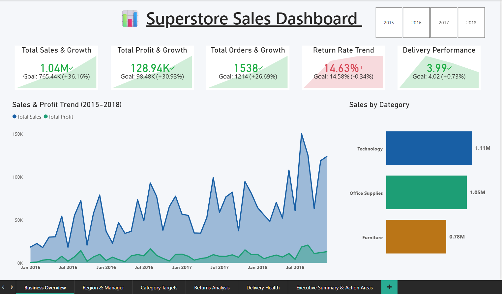
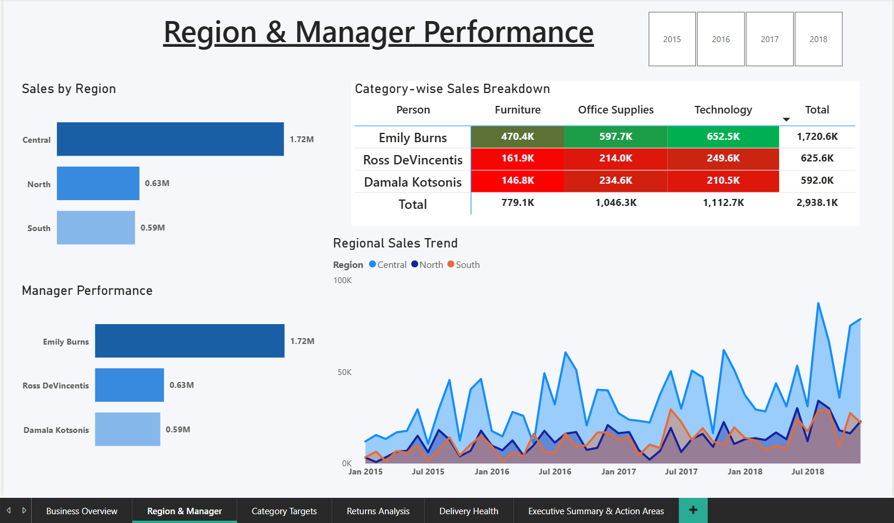
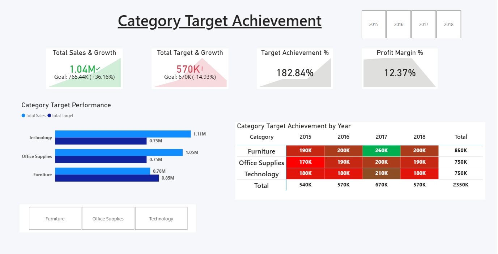
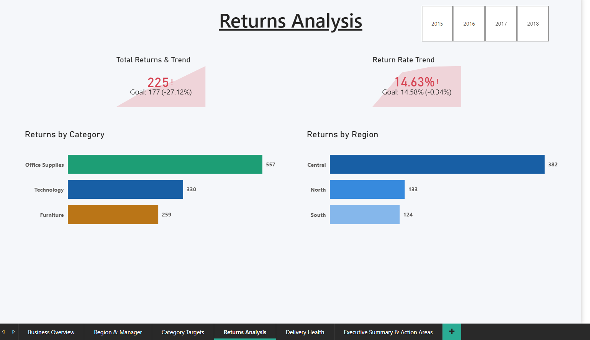
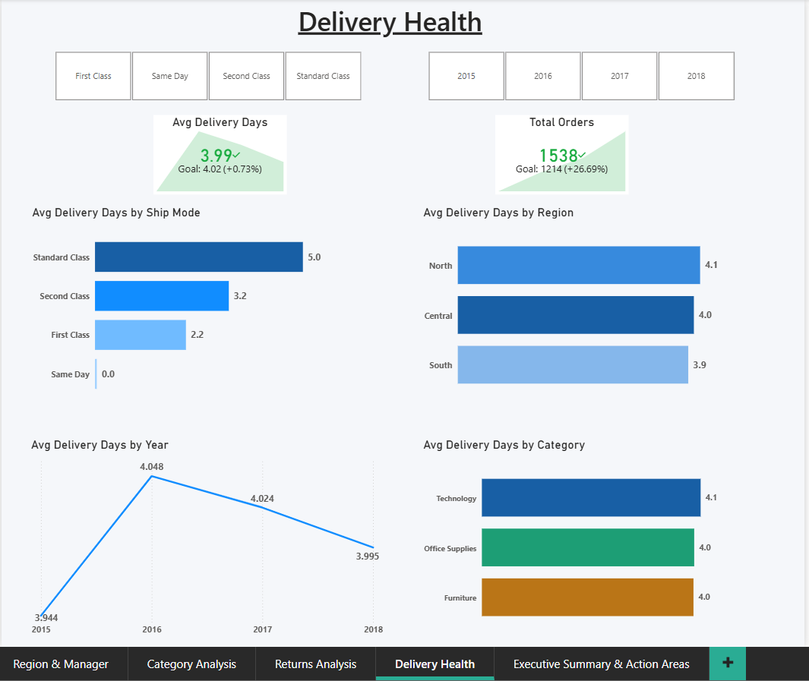
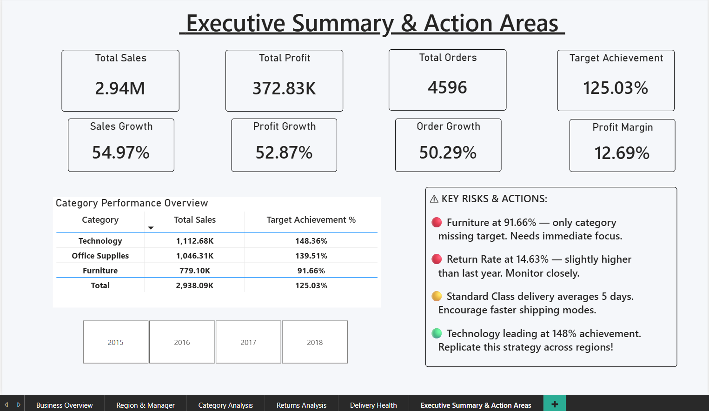

# 📊 Superstore Sales Dashboard | Power BI

> **An interactive 6-page Power BI dashboard built for a regional sales company to analyze business performance, track category-wise targets, monitor returns, and evaluate delivery health across regions and managers.**

---

## 📎 Dashboard File

> 🔗 **[Download & View PBIX File — Google Drive](https://drive.google.com/file/d/1b1rQ88_AemSC-StkUzTXPZjc1FcSLVk9/view?usp=drive_link)**

---

## 🏢 Business Problem

A regional sales company was struggling with manual, spreadsheet-based reporting. The Sales Manager had no clear view of:

- Whether sales and profit were **growing year-over-year**
- Which **Regional Managers** were hitting or missing category targets
- Whether **product returns** were increasing and where they were coming from
- Whether **delivery delays** were affecting customer satisfaction

Leadership needed a dashboard that could be used in **monthly business reviews** — simple enough for a non-technical manager, yet powerful enough to answer every critical question.

---

## 🎯 Dashboard Pages

### Page 1 — Business Overview


**Questions answered:**
- Is the business growing vs last year?
- What is the overall sales, profit, and order trend?
- Which category generates the most revenue?

**Key Findings (2018):**
- Total Sales: **1.04M** ↑ 36.16% vs 2017
- Total Profit: **128.94K** ↑ 30.93% vs 2017
- Total Orders: **1,538** ↑ 26.69% vs 2017
- Technology is the top-selling category at **1.11M**

---

### Page 2 — Region & Manager Performance


**Questions answered:**
- Which region is performing best?
- Which manager is driving the most sales?
- How is each manager performing across product categories?

**Key Findings:**
- **Emily Burns (Central)** — top performer at **1.72M**
- **Ross DeVincentis (North)** — **0.63M**
- **Damala Kotsonis (South)** — **0.59M**
- Central region leads all regions consistently

---

### Page 3 — Category Target Achievement


**Questions answered:**
- Are sales targets being achieved by category?
- Which category is underperforming vs target?
- How have targets changed year over year?

**Key Findings (2018 — Target = 570K):**
- Technology: **1.11M sales vs 0.75M target** ✅ — exceeding
- Office Supplies: **1.05M sales vs 0.75M target** ✅ — exceeding
- Furniture: **0.78M sales vs 0.85M target** ⚠️ — **only category below target**

---

### Page 4 — Returns Analysis


**Questions answered:**
- Are returns increasing compared to last year?
- Which category and region has the most returns?

**Key Findings:**
- Total Returns: **637** — Rate: **13.86%**
- **Office Supplies** has the highest returns: **557**
- **Central region** has the most returns: **382**
- Return rate slightly increased vs last year ⚠️

---

### Page 5 — Delivery Health


**Questions answered:**
- Which shipping mode causes the most delays?
- Is delivery improving or worsening over time?
- Are any regions consistently slow?

**Key Findings:**
- Standard Class = **5.0 days** (slowest) ⚠️
- Same Day = **0.0 days** (fastest) ✅
- Delivery improved: 4.05 days (2016) → **3.99 days (2018)** ✅
- All regions averaging ~4 days consistently

---

### Page 6 — Executive Summary & Action Areas


**The decision-making page for leadership reviews.**

| Metric | Value |
|--------|-------|
| Total Sales | 2.94M |
| Total Profit | 372.83K |
| Total Orders | 4,596 |
| Target Achievement | 125.03% |
| Sales Growth YoY | 54.97% |
| Profit Growth YoY | 52.87% |

**Key Risks & Actions:**
- 🔴 Furniture at **91.66%** — only category missing target. Needs immediate focus
- 🔴 Return Rate at **14.63%** — slightly higher than last year. Monitor closely
- 🟡 Standard Class delivery averages **5 days** — encourage faster shipping modes
- 🟢 Technology leading at **148% achievement** — replicate this strategy across regions

---

## 🗂️ Dataset

| File | Description |
|------|-------------|
| `order_2015.csv` to `order_2018.csv` | Sales orders across 4 years (appended) |
| `People.csv` | Regional Manager → Region mapping |
| `Returns.csv` | Returned order IDs |
| `Target.csv` | Category-wise sales targets by year |

---

## 🔧 Technical Details

### Data Model
```
Orders ──── People       (Region → Region)
Orders ──── Returns      (Order ID → Order ID)
Orders ──── DateTable    (Order Date → Date)
Target ──── Orders       (Category → Category)
```

### Key DAX Measures
```dax
Total Sales     = SUM(Orders[Sales])
Total Profit    = SUM(Orders[Profit])
Total Orders    = DISTINCTCOUNT(Orders[Order ID])
Total Returns   = COUNTROWS(Returns)

Sales LY        = CALCULATE([Total Sales], SAMEPERIODLASTYEAR(DateTable[Date]))
Sales YoY %     = DIVIDE([Total Sales] - [Sales LY], [Sales LY], 0)

Total Target    = CALCULATE(SUM(Target[Target Sales]),
                  FILTER(Target, Target[Year] = SELECTEDVALUE(DateTable[Year], 0)))

Target Achievement % = DIVIDE([Total Sales], [Total Target], 0)

Avg Delivery Days    = AVERAGEX(Orders,
                       DATEDIFF(Orders[Order Date], Orders[Ship Date], DAY))

Return Rate %        = DIVIDE([Total Returns], [Total Orders], 0)
```

### Tools Used
- **Power BI Desktop** — Dashboard development
- **Power Query** — Data cleaning & transformation
- **DAX** — KPI calculations and YoY measures
- **GitHub** — Version control and portfolio

---

## 📁 Repository Structure

```
superstore-powerbi-dashboard/
│
├── data/                    # Source CSV files
│   ├── order_2015.csv
│   ├── order_2016.csv
│   ├── order_2017.csv
│   ├── order_2018.csv
│   ├── People.csv
│   ├── Returns.csv
│   └── Target.csv
│
├── images/                  # Dashboard screenshots
│   ├── 1.png               # Business Overview
│   ├── 2.png               # Region & Manager
│   ├── 3.png               # Category Targets
│   ├── 4.png               # Returns Analysis
│   ├── 5.png               # Delivery Health
│   └── 6.png               # Executive Summary
│
├── problem_statement/       # Assignment PDF
│
├── README.md
└── LICENSE
```

---

## 🚀 How to Use

1. Click the **Google Drive link** above to download the `.pbix` file
2. Open in **Power BI Desktop** (free — download from Microsoft)
3. Use the **Year slicer** on each page to filter by year
4. Click any bar or region to **cross-filter** all visuals on the page
5. Navigate pages using the **tabs at the bottom**

---

## 👤 Author

**Aditya** — Data Analyst  
📍 West Bengal, India  
🔗 [GitHub](https://github.com/aditya-datahub)

---

## 📄 License

MIT License — see [LICENSE](LICENSE) for details.

---

*Built as part of a Data Analyst Assignment for KS AI & Cloud Solutions — June 2026*
